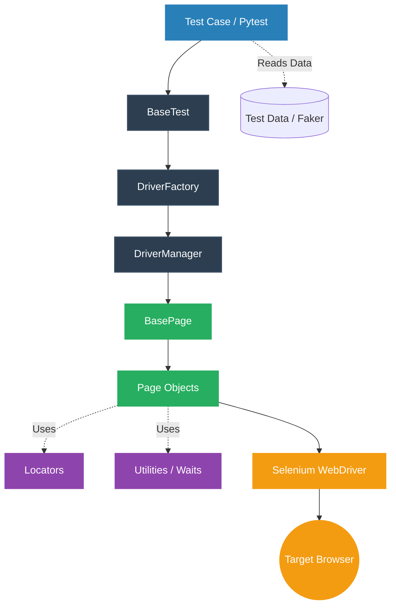
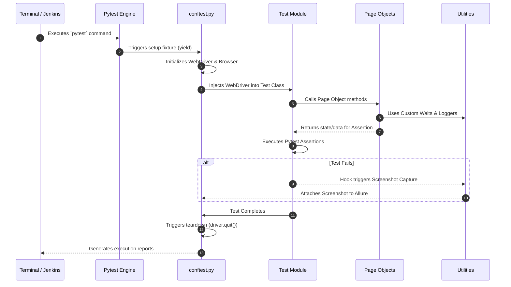

# Selenium Automation Framework

## Detailed Technical Documentation

---

### Project

Automation Framework for Web UI Testing

---

### Developed By

**Karthik S**

QA Automation Engineer

---

### Framework Version

Version : 1.0

---

### Technologies

- Python
- Selenium WebDriver
- Pytest
- Allure Reports
- HTML Reports
- WebDriver Manager
- Page Object Model
- Jenkins CI

---

### Supported Browsers

- Google Chrome
- Microsoft Edge
- Mozilla Firefox

---

### Last Updated

July 2026

---

# Revision History

| Version | Date | Author | Description |
|----------|------------|-------------|---------------------------|
| 1.0 | July 2026 | Karthik S | Initial Framework Documentation |

---

# Table of Contents

1. Introduction
2. Project Overview
3. Objectives
4. Technology Stack
5. Framework Architecture
6. Folder Structure
7. Folder Description
8. Driver Management
9. Framework Execution Flow
10. Driver Lifecycle
11. Page Object Model
12. Base Classes
13. Utilities
14. Configuration Management
15. Logging
16. Reporting
17. Screenshot Mechanism
18. Retry Mechanism
19. Test Data Management
20. Assertion Helper
21. Browser Support
22. Test Execution
23. Jenkins Integration
24. Best Practices
25. Future Enhancements
26. Conclusion

---

# 1. Introduction

This Selenium Automation Framework is designed to automate web application testing using Python, Selenium WebDriver, and Pytest.

The framework follows industry-standard automation practices including the Page Object Model (POM), reusable utilities, centralized driver management, configurable execution, and detailed reporting.

The primary goal of this framework is to provide a scalable, maintainable, and reusable automation solution suitable for enterprise web applications.

The framework has been developed with modular architecture, allowing future expansion to API automation, parallel execution, Docker, BrowserStack, and CI/CD pipelines.

The framework is currently used for automating multiple modules of the company web application including Login and Company Management.

---

# 2. Project Overview

The framework is built around the Page Object Model architecture where each web page is represented as a separate class.

Test cases remain clean and readable by separating:

- Test Logic
- UI Locators
- Page Actions
- Utility Functions

This separation significantly improves maintainability and reduces code duplication.

Current automated modules include:

- Login Module
- Company Module
  - Create Company
  - View Company
  - Edit Company
  - Delete Company
  - Refresh Company Grid

Additional modules can easily be added without modifying the existing architecture.

---

# 3. Objectives

The primary objectives for engineering this framework include:

- **Accelerate Feedback Loops:** Drastically reduce regression testing time, allowing developers to deploy code with confidence.
- **Ensure High Maintainability:** Utilize design patterns that isolate UI changes, ensuring that a change in the application does not break the entire test suite.
- **Enhance Traceability:** Provide rich, granular reporting that highlights exactly where and why a failure occurred without needing to rerun the test manually.
- **Enable Scalability:** Build a foundation that can easily adopt parallel execution, Docker containerization, and API-layer testing in the future.
- **Reusability:** Abstract common browser actions into utility classes to prevent code duplication across test scripts.

---

# 4. Technology Stack

The framework leverages a modern, Python-centric ecosystem, carefully selected for its vast library support, readability, and speed of development.

| Category | Technology | Description |
| :--- | :--- | :--- |
| **Core Language** | Python 3.x | Highly readable, robust ecosystem, excellent for rapid test development. |
| **Test Runner** | Pytest | Powerful fixture management, parameterized testing, and native assertion handling. |
| **Web Automation** | Selenium WebDriver | The industry standard for cross-browser UI interaction and DOM manipulation. |
| **Driver Management** | `webdriver-manager` | Dynamically fetches and manages browser executables, eliminating manual path configurations. |
| **Data Generation** | Faker | Dynamically generates realistic test data (names, emails, phones) to prevent data exhaustion. |
| **Reporting** | Allure Reports | Generates visually rich, interactive, step-by-step execution reports with attached screenshots. |
| **CI/CD Orchestration** | Jenkins | Automates test execution based on triggers (e.g., code commits, nightly schedules). |
| **Version Control** | Git & GitHub | Distributed version control for source code management and collaborative development. |

---

# 5. Framework Architecture

The architecture is strictly driven by the **Page Object Model (POM)** and **Separation of Concerns**. The framework operates in a unidirectional flow from test initialization, through UI interactions, to teardown and reporting.

Below is the high-level architecture demonstrating how test cases interact with the core engine:



---

# 6. Folder Structure

A well-organized repository is the backbone of a maintainable automation framework. This structure cleanly separates the framework's core engine from the actual test scripts and documentation.

```text
Automation_Framework/
│
├── config/                 # Global configuration (URLs, Timeouts, Environment)
├── constants/              # Static constants and expected UI text/messages
├── docs/                   # Framework documentation, architecture diagrams, and PDFs
├── fixtures/               # Pytest fixtures (conftest.py) for setup/teardown
├── locators/               # Centralized DOM selectors (XPath, CSS, ID)
├── pages/                  # Page Object classes containing UI actions
├── tests/                  # Pytest execution scripts and assertions
├── utilities/              # Reusable helpers (Logging, Waits, Assertions, Screenshots)
├── reports/                # Generated Allure XML data and HTML reports
├── screenshots/            # Automatically captured images of test failures
├── logs/                   # Execution log files (.log)
├── testdata/               # Static data files (JSON, CSV, Excel)
├── pytest.ini              # Pytest configuration and runtime markers
├── requirements.txt        # Python dependencies and versions
└── README.md               # Quick-start guide
```
---

# 7. Folder Description

Every directory in this framework exists to enforce the **Separation of Concerns** design principle. 

| Folder | Core Responsibility | Professional Justification |
| :--- | :--- | :--- |
| **`config/`** | Stores `config.py`, holding global variables like URLs, browser types, and timeouts. | Prevents hardcoding. Updating a target environment URL instantly propagates to the entire test suite. |
| **`locators/`** | Python classes storing raw DOM selectors (XPath, CSS, ID). | If UI developers change an element's ID, QA engineers update a single locator file rather than hunting through tests. |
| **`pages/`** | Houses POM classes containing user action methods (e.g., `click_login()`). | Hides WebDriver commands from test scripts, ensuring tests read as clean, plain-English steps. |
| **`tests/`** | Execution scripts written using Pytest. | Kept purely for assertions and test flow. No WebDriver logic exists here. |
| **`utilities/`** | Abstracted helpers (Logger, Wait, Assertions, Screenshot, Faker). | Eliminates code duplication. Calling a centralized `wait_for_visibility()` replaces writing repetitive WebDriverWait blocks. |
| **`fixtures/`** | Contains `conftest.py` for setup/teardown operations. | Leverages Pytest's dependency injection to supply the WebDriver instance seamlessly. |

---

# 8. Driver Management

Handling WebDriver binaries manually creates a brittle execution environment. This framework eradicates that issue by utilizing centralized and dynamic driver management via the `webdriver-manager` library.

**Architectural Advantages:**
- **Zero Configuration:** Engineers can clone the repository and execute tests immediately without setting system PATH variables.
- **CI/CD Compatibility:** Jenkins nodes do not require manual WebDriver binary updates; the framework dynamically fetches the correct version at runtime.
- **Cross-Browser Scalability:** Seamlessly switches between Chrome, Firefox, and Edge based on configurations.

---

# 9. Framework Execution Flow

Understanding the exact sequence of events during a test run is critical for debugging and scaling. Below is the sequence triggered when a user executes `pytest` via the terminal or Jenkins pipeline.


---

# 10. Driver Lifecycle

The Driver Lifecycle dictates how the Selenium WebDriver is instantiated, utilized, and destroyed to prevent memory leaks and zombie processes. This is handled gracefully using Pytest's `conftest.py`.

### The `yield` Fixture Strategy
Instead of using legacy `setup()` and `teardown()` methods inside every test class, we use Pytest fixtures with the `yield` keyword.
1. **Setup:** Code *before* `yield` initializes the browser, maximizes the window, and injects it into the test.
2. **Execution:** The test runs using the yielded driver instance.
3. **Teardown:** Code *after* `yield` unconditionally executes `driver.quit()`, ensuring the browser closes regardless of whether the test passed or failed.

---

# 11. Page Object Model (POM)

The framework strictly adheres to the Page Object Model (POM) design pattern. For every physical web page or major component in the application, a corresponding Python class is created in the `pages/` directory.

### Structural Rules:
- **No Assertions in Pages:** Page classes handle *interactions* (clicks, inputs, reads). They return booleans, strings, or object states. The actual `assert` statements belong strictly in the `tests/` directory.
- **No Locators in Tests:** A test script should never contain an XPath or CSS selector. This ensures that UI changes only impact the locator dictionary, not the test logic.

---

# 12. Base Classes

To maximize code reusability and centralize WebDriver configurations, the framework utilizes parent Base Classes that child classes inherit from.

### `BasePage.py`
This is the parent class for all Page Objects. It acts as a robust, protective wrapper around native Selenium methods. Instead of calling `driver.find_element().click()`, Page Objects call `self.click_element(locator)`. 
* **Architectural Benefit:** If we need to add an automatic explicit wait, highlight an element before clicking, or add custom logging to *every* click in the framework, we only modify the `BasePage` click method. This instantly propagates the enhancement to hundreds of individual page methods.

### `BaseTest.py`
This is the parent class for all Pytest test classes. It applies class-level Pytest markers (e.g., `@pytest.mark.usefixtures("init_driver")`) so that individual test classes automatically inherit the WebDriver instance, setup, and teardown configurations without writing repetitive boilerplate code.

---

# 13. Utilities

The Utilities module acts as the engine room of the framework. It abstracts complex or repetitive logic into standalone helper classes, ensuring that the Page Objects and Test classes remain clean, readable, and focused solely on business logic.

### Key Utility Components:
- **WaitHelper:** Centralizes Explicit Waits (e.g., `wait_for_visibility`, `wait_for_clickable`), completely replacing flaky Implicit Waits and hardcoded `time.sleep()` commands.
- **LoggerHelper:** Standardizes how logs are captured, formatted, and routed (to console and files) across the framework.
- **ScreenshotHelper:** Manages capturing and saving timestamped UI snapshots when exceptions occur.
- **Data Readers (Excel/JSON):** Parses external data files to feed data-driven tests (DDT).
- **Faker Integration:** Generates dynamic, randomized data (names, emails, phone numbers) on the fly to prevent database exhaustion.

---

# 14. Configuration Management

To ensure the framework is highly adaptable and scalable, all environment-specific variables are decoupled from the test scripts and stored in a centralized configuration module (`config/config.py`).

### Responsibilities of `config.py`:
- **Environment URLs:** Manages base URLs for different execution environments (e.g., QA, Staging, Production).
- **Global Credentials:** Stores default test user credentials (often fetched securely from OS environment variables).
- **Browser Preferences:** Defines which browser to launch and whether to execute in standard or headless mode.
- **Timeouts:** Sets the global thresholds for explicit waits.

### Architectural Benefit
If the target test environment shifts from Staging to Production, the Base URL is updated in exactly one line of code within `config.py`. This prevents the need to refactor hundreds of individual test files, enabling immediate, seamless execution across different environments.

---

# 15. Logging

Effective logging is critical for unattended execution, especially when tests run autonomously in a CI/CD pipeline. When a failure occurs at 2:00 AM, logs provide the exact forensic trail of events leading up to the crash, eliminating the need to guess or manually reproduce the issue.

### Implementation Details
The framework utilizes Python's built-in `logging` module, wrapped inside a custom `LoggerHelper` utility to standardize outputs across all test modules.
- **Formatting:** Every log entry is timestamped, tagged with its severity level, and indicates the originating class/module.
- **Log Levels Used:**
  - `INFO`: Records standard, successful test steps (e.g., "Navigated to Login Page", "Clicked Submit").
  - `WARNING`: Records non-fatal anomalies, such as dynamic element retries.
  - `ERROR`: Captures test failures, TimeoutExceptions, and application crashes.
- **Storage:** Logs are output directly to the console for live Jenkins console tracking, and simultaneously written to timestamped `.log` files in the `logs/` directory for artifact archiving.

---

# 16. Reporting

To provide clear, actionable visibility to QA engineers, developers, and management, the framework integrates **Allure Reports** as its primary reporting engine.

### Allure Integration
Allure generates visually rich, interactive HTML reports that track pass/fail metrics, execution duration, and historical trends. The framework enhances test scripts using Allure decorators:
- **`@allure.title()` & `@allure.description()`:** Maps technical test functions to readable business requirements.
- **`@allure.step()`:** Wraps Page Object methods to break down a test into readable, logical steps (e.g., *Step 1: Enter Credentials, Step 2: Click Login*).
- **`@allure.severity()`:** Categorizes tests (e.g., BLOCKER, CRITICAL, MINOR) to help the team prioritize bug triage.

### Automated Evidence Attachments
The framework is engineered to automatically collect evidence upon failure. By utilizing Pytest hooks (`pytest_runtest_makereport`), the framework detects if a test fails and instantly triggers the `ScreenshotHelper`. The captured screenshot, along with the execution log, is embedded directly into the failed test step within the Allure report. This ensures all debugging context is centralized in one interface.

---

# 17. Screenshot Mechanism

In UI automation, visual evidence of a failure is often the fastest way to diagnose an issue. The framework includes an automated, zero-touch screenshot capture mechanism that triggers exactly when a test fails.

### How It Works
Instead of manually writing `driver.save_screenshot()` in `except` blocks across every test, the framework utilizes Pytest hooks (specifically `pytest_runtest_makereport` inside `conftest.py`). 

1. **Failure Detection:** The hook listens to the execution status of every test. If the status evaluates to `failed` or `error`, the screenshot utility is instantly invoked.
2. **Dynamic Naming Convention:** To prevent overwriting, screenshots are saved dynamically using the test name and a precise timestamp (e.g., `test_invalid_login_20260729_143022.png`).
3. **Storage & Attachment:** The image is saved locally in the `screenshots/` directory. Immediately after, it is converted to a byte array and embedded directly into the Allure report, ensuring the visual evidence is permanently tied to the specific test execution.

---

# 18. Retry Mechanism

Flakiness is the biggest enemy of UI automation. Tests can occasionally fail due to transient issues like network latency, slow server responses, or temporary rendering delays. To combat this, the framework implements a robust retry mechanism.

### Handling Flaky Tests
The framework utilizes the `pytest-rerunfailures` plugin (or custom retry loops in the wait utilities) to automatically re-execute failed tests before officially marking them as a failure in the final report.

- **Configurable Retries:** The number of retries is configured globally via `pytest.ini` (e.g., `--reruns 2`). This means if a test fails, Pytest will immediately try it up to two more times.
- **Delay Between Retries:** A cooldown period (e.g., `--reruns-delay 3`) is added between attempts to allow the application or DOM to stabilize before the framework interacts with it again.
- **Architectural Benefit:** This drastically reduces false negatives in CI/CD pipelines. A test is only reported as failed if it consistently fails across all retry attempts, ensuring that the development team only investigates legitimate application defects.

---

# 19. Test Data Management

Hardcoding test data (like usernames, contact details, or company names) directly into test scripts leads to brittle tests and data exhaustion. The framework implements a robust Data-Driven Testing (DDT) strategy to strictly separate data from execution logic.

### Static vs. Dynamic Data
- **Static Data (JSON/Excel):** Used for fixed datasets, such as administrative login credentials, environment URLs, or expected static error messages. This data is read through custom utility parsers and fed into tests.
- **Dynamic Data (Faker):** Used heavily for the **Contact** and **Company** modules. By utilizing the Python `Faker` library, the framework dynamically generates realistic, randomized names, emails, and phone numbers at runtime. 
- **Architectural Benefit:** Generating dynamic data ensures that tests do not fail due to database constraints (e.g., "Email already exists") when the suite is run multiple times a day in CI/CD pipelines.

---

# 20. Assertion Helper

While Pytest's native `assert` keyword is powerful, writing raw assertions throughout test files limits logging capabilities. The framework centralizes validations through a custom `AssertionHelper` utility.

### Implementation Advantages
- **Rich Logging:** Instead of a silent pass, the Assertion Helper explicitly logs the validation to the console and Allure reports (e.g., `[INFO] Assertion Passed: Expected 'Dashboard', Actual 'Dashboard'`).
- **Enhanced Error Handling:** If an assertion fails, the helper intercepts the failure to log a customized, highly readable error message before raising the exception that triggers the screenshot utility.
- **Reusable Validations:** Common UI validations are abstracted into methods like `verify_element_displayed(locator)`, `verify_text_matches(expected, actual)`, and `verify_list_contains(item, list)`.

---

# 21. Browser Support

Enterprise web applications must function seamlessly across multiple web browsers. The framework is engineered for native cross-browser compatibility without requiring script modifications.

### Supported Browsers & Headless Execution
- **Browsers Supported:** Google Chrome, Mozilla Firefox, and Microsoft Edge.
- **Dynamic Instantiation:** The target browser is passed as an environment variable or command-line argument. The `DriverFactory` reads this parameter and instantiates the correct driver via `webdriver-manager`.
- **Headless Mode:** For CI/CD environments (like Jenkins) where no GUI exists, the framework can be configured to run browsers in "Headless" mode. This bypasses UI rendering, significantly reducing execution time and CPU overhead.

---

# 22. Test Execution

The framework is highly configurable via the command line interface (CLI), allowing engineers to execute specific subsets of the 35 currently automated test cases covering the Login, Contact, and Company modules.

### Pytest CLI and Markers
Using `pytest.ini` and custom markers, tests can be grouped logically (e.g., `@pytest.mark.smoke`, `@pytest.mark.regression`). This allows for targeted execution rather than running the entire suite for a minor code change.

**Common Execution Commands:**
```bash
# Execute the entire test suite
pytest tests/

# Execute only Smoke tests
pytest -m smoke tests/

# Execute tests for a specific module (e.g., Company module)
pytest tests/test_company.py

# Execute tests in headless mode against a specific browser
pytest tests/ -v --browser=firefox --headless

```

---

# 23. Jenkins Integration

To transition from local execution to an enterprise-grade CI/CD pipeline, the framework is integrated with **Jenkins**. This ensures that tests run automatically without manual intervention.

### Pipeline Architecture
- **Trigger Mechanisms:** The Jenkins job can be triggered via Webhooks on code pushes/pull requests to GitHub, or scheduled via Cron for nightly regression runs.
- **Environment Provisioning:** The pipeline runs on an isolated agent node, clones the `Automation_Framework` repository, and automatically sets up a clean Python virtual environment.
- **Dependency Management:** The pipeline executes `pip install -r requirements.txt` to install the precise package versions required by the framework.
- **Execution & Reporting:** Jenkins runs the target `pytest` commands, archives logs and screenshots as build artifacts, and triggers the Allure Jenkins plugin to render visual reports directly on the build dashboard.

---

# 24. Best Practices

To maintain high code quality and architectural integrity across the team, the framework strictly enforces the following industry standards:

- **Strict Separation of Concerns:** Locators, test data, assertions, and page actions must never be commingled within a single file.
- **No Hardcoded Waits:** The use of `time.sleep()` is strictly forbidden; all asynchronous timing relies exclusively on Explicit Waits within the `WaitHelper`.
- **Meaningful Test Naming:** Test functions must explicitly state what is being tested and expected (e.g., `test_login_with_invalid_password_shows_error`).
- **Idempotency:** Test cases should ideally be independent and clean up after themselves, ensuring that running Test B does not fail because of data modified by Test A.
- **Version Control Discipline:** All code modifications must be reviewed via Pull Requests, passing linting and baseline smoke tests before merging to the main branch.

---

# 25. Future Enhancements

As the software ecosystem grows, the framework is architected to easily scale into advanced testing paradigms:

- **Parallel Execution:** Integrating `pytest-xdist` to run tests concurrently across multiple browser instances, slashing overall execution time.
- **Docker Containerization:** Packaging the entire framework, dependencies, and browser binaries into a Docker container to ensure absolute environment parity across local machines and CI/CD agents.
- **Cloud Grid Integration (BrowserStack/Sauce Labs):** Extending `DriverFactory` to spin up tests on remote cloud devices and cross-platform browser combinations.
- **API Automation Layer:** Introducing a `requests`-based API testing module within the framework to validate backend responses and perform database setups before UI execution.

---

# 26. Conclusion

The Selenium Automation Framework serves as a robust, scalable, and professional backbone for the organization's web application quality assurance. By enforcing modern design patterns like the Page Object Model, centralized driver management, comprehensive logging, and automated Allure reporting, the framework eliminates regression bottlenecks.

With 35 automated test cases securely integrated into Jenkins covering the Login, Contact, and Company modules, the framework provides an instant safety net for continuous delivery. It stands as a testament to Senior SDET engineering practices, ensuring high software reliability, fast feedback loops, and a dependable foundation for future technological growth.

